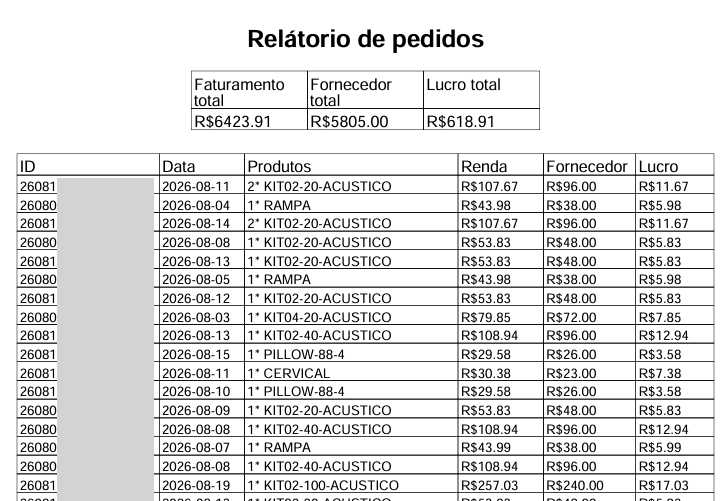
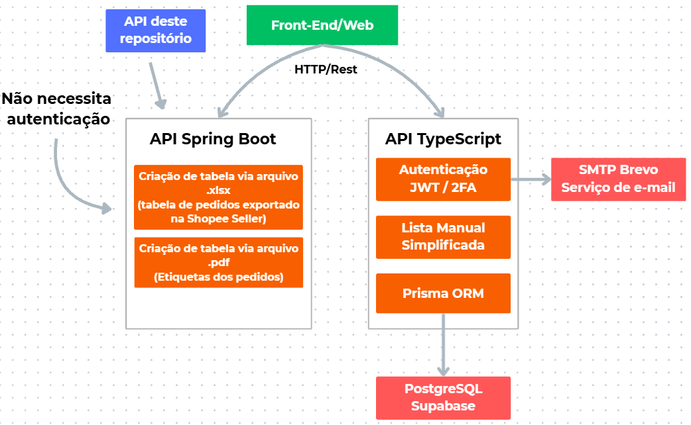

# ➜ API em Spring Boot/Java — Shopee Supplier Calculator
Shopee Supplier Calculator: https://shopee-supplier-calculator.netlify.app

O Shopee Supplier Calculator foi desenvolvido para auxiliar o gerenciamento financeiro de um grupo de comerciantes virtuais que possuem lojas centralizadas na plataforma da Shopee.

Ao comercializar produtos pela internet, é importante possuir uma forma eficiente de **registrar** os pedidos em **tabelas** ou **planilhas**. Entretanto, os comerciantes enfrentavam dificuldades nesse processo: o registro manual dos pedidos é repetitivo, trabalhoso e suscetível a erros, além da necessidade de calcular manualmente métricas como lucro e taxas de fornecedores.

Diante desse problema, surgiu a necessidade de **automatizar** e **simplificar** o gerenciamento dos pedidos, reduzindo o trabalho manual e a possibilidade de erros no preenchimento dos dados.

### ➜ Soluções propostas

Com base no problema identificado, foram propostas duas soluções:

- ***Solução 1***: facilitar o registro manual dos pedidos por meio de uma tabela simplificada, realizando automaticamente o cálculo de algumas métricas.

- ***Solução 2***: criar uma tabela totalmente automatizada, na qual o usuário precisa apenas fornecer um arquivo contendo as informações dos pedidos.

Esta API desenvolvida em Spring Boot é responsável pela solução 2.

A proposta é fornecer ao usuário uma maneira de criar tabelas **automaticamente**, sem necessidade de preenchimento de dados ou cálculos manuais.

A API responsável pela solução 1 está disponível em outro repositório. Repositório: https://github.com/Nicolas-Geovane880/Shopee-Typescript-API-Backend

### ➜ O que essa API faz?

No Shopee Seller, é possível exportar um arquivo **.xlsx** que contém todas as informações de cada pedido em um intervalo pré-definido.

Esse arquivo possui informações como: 

- ID do pedido
- SKUs
- Data do pedido
- Subtotal
- Quantidade
- Taxas da Shopee

Com essas informações, a API consegue **identificar** e **extrair** os dados relevantes de cada pedido e criar uma tabela com todos os pedidos de forma automática, sem precisar do usuário
informar algum tipo de dado.

A tabela criada de forma automática possui todas as métricas que os vendedores precisam, como:

- ID do pedido
- Data do pedido
- Renda líquida (sem as taxas da Shopee)
- Taxa de fornecedores (baseados nos SKUs)
- Lucro
- Soma de todas as métricas (total de renda líquida, taxa de fornecedores e lucro)

Além do arquivo de pedidos .xlsx, é possível exportar as etiquetas de cada pedido em formato **.pdf**. Porém a tabela
criada não possuirá todas as métricas, como renda líquida e lucro, já que esses valores não estão presentes nas etiquetas.

#### ➜ Exemplo de uma tabela gerada a partir de um arquivo .xlsx exportado da Shopee

A tabela apresenta informações como ID, data, produto, rendimento, custo do fornecedor e lucro.
Os valores totais de faturamento, custo do fornecedor e lucro
também são atualizados automaticamente conforme novos pedidos são adicionados.



### Fluxo desejado: 

➜ Arquivo .xlsx

````
Usuário exporta o arquivo .xlsx em um intervalo pré-definido (ex: pedidos do dia, última semana ou quinzena)
                                                |
                                                ▼
                          API mapeia as informações relevantes no arquivo
                                                |
                                                ▼
                                       Cálculo das métricas    
                                                |
                                                ▼
                            API cria a tabela com métricas relevantes
                                                |
                                                ▼
        API retorna um arquivo .pdf com a tabela criada (todos os pedidos e as métricas totais)
````

➜ Arquivo .pdf (etiquetas)

````
                    Usuário exporta os arquivos .pdf (podem ser mais de um)
                                            |
                                            ▼
                            API mapeia informações via regex
                                            |
                                            ▼
                          API cria a tabela com informações básicas
                                            |
                                            ▼
API retorna um arquivo .pdf com a tabela criada (todas as etiquetas ficam resumidas em um único arquivo)

````

#### ➜ Autenticação

Diferentemente da API responsável pela solução 1, esta API não **exige autenticação** para utilizar os recursos de processamento e geração das tabelas. O usuário pode usar 
desses recursos apenas apertando em ``"Usar recursos sem autenticaçao"`` na interface do Front-End.

### ➜ Arquitetura



### ➜ Stack

- Java 21
- Spring Boot Framework
- Maven

libs:
- OpenPDF
- PDFBox


